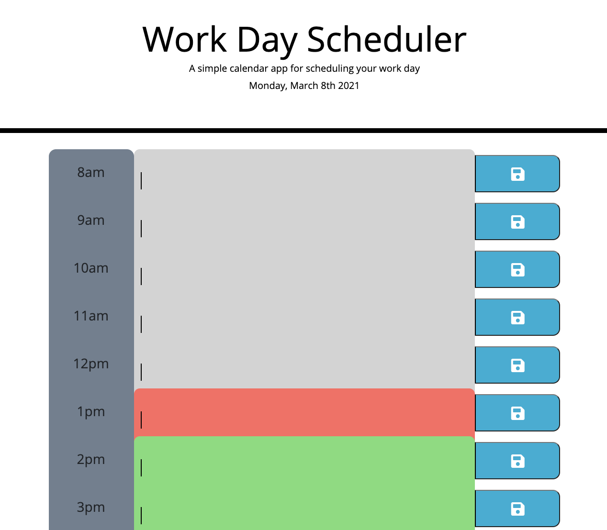
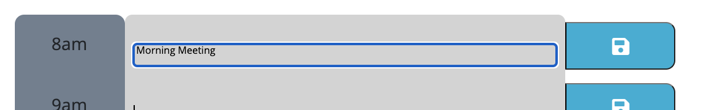

# workday-scheduler
NU Coding Bootcamp Homework: Workday Scheduler

<h1>Contents</h1>
<ol>
<li><a href="#repository">The Repository</a></li>
<li><a href="#workday-scheduler">Workday Scheduler</a></li>
</ol>

<h1 id="repository">The Repository</h1>
The <code>workday-scheduler</code> repository contains HTML, CSS & JavaScript files for a daily scheduler that runs using javascript.
<h1 id="workday-scheduler">Workday Scheduler</h1>
My random password generator can be found here: <a href="https://emilyalv.github.io/workday-scheduler/.">https://emilyalv.github.io/workday-scheduler/.</a>

The Workday scheduler shows the current day at the top of the screen using Moment.js. Each row is color coded depending on whether the time slot is in the past, present or future. The user is able to input and view content in each time slot.

